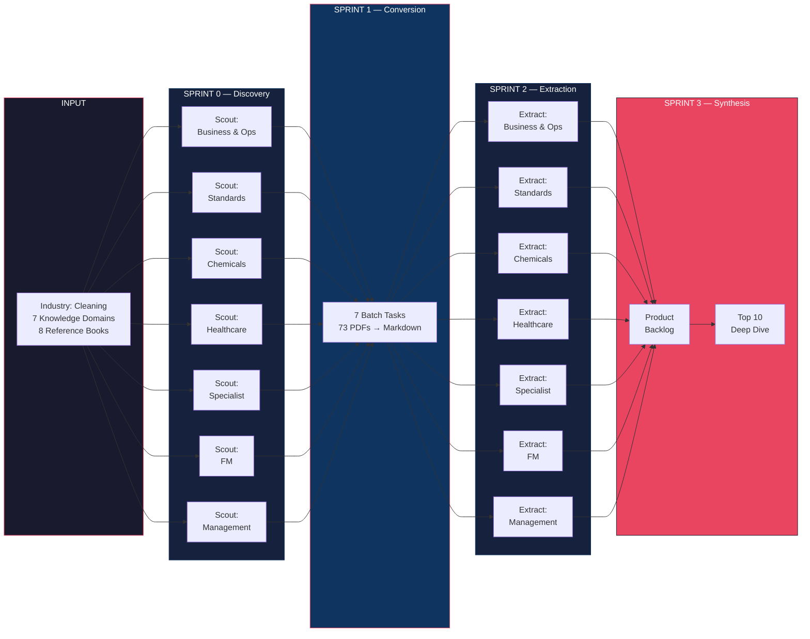
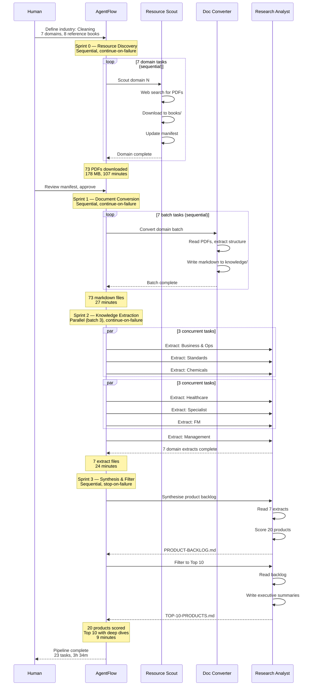
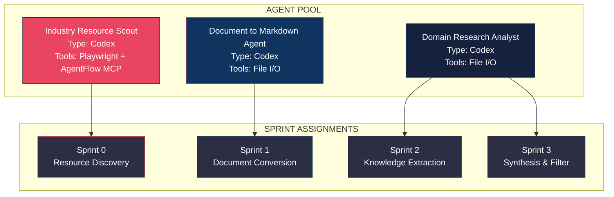
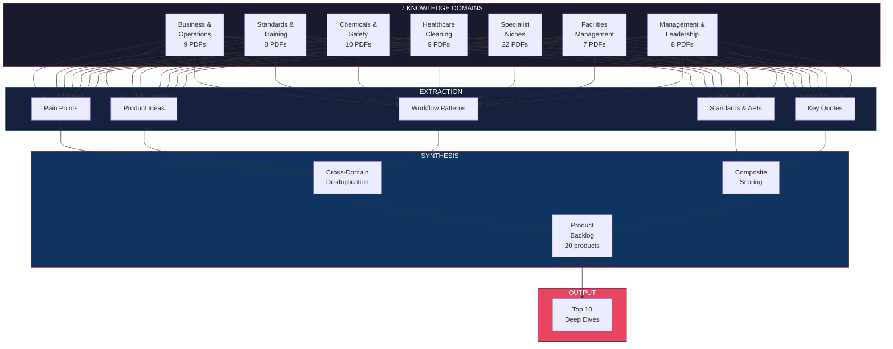

# Industry Research Pipeline

This document describes the full AgentFlow pipeline that produced the cleaning industry sector analysis. The pipeline is reusable — only the industry name and domain list change between runs.

---

## Pipeline Overview

---

## Orchestration Sequence

This sequence diagram shows the full interaction between human, AgentFlow, and the three specialist agents across the pipeline.

---

## Agent Architecture

Three specialist agents collaborated across the pipeline. Each agent is autonomous within its task but orchestrated by AgentFlow's sprint engine.

| Agent | Role | Sprint(s) | Tasks |
|-------|------|-----------|-------|
| **Industry Resource Scout** | Searches the web for publicly available PDFs, downloads them, and maintains a source manifest with URLs, page counts, and publication dates | Sprint 0 | 7 |
| **Document to Markdown Agent** | Converts PDF documents to structured markdown, preserving tables, headings, and key content | Sprint 1 | 7 |
| **Domain Research Analyst** | Extracts domain knowledge (pain points, product ideas, workflow patterns, standards) and synthesises cross-domain product opportunities | Sprint 2, 3 | 9 |

---

## Domain Coverage

Seven knowledge domains were researched independently, then merged during synthesis to identify cross-domain product opportunities.

---

## Sprint Execution Detail

### Sprint 0: Resource Discovery

| Property | Value |
|----------|-------|
| Execution mode | Sequential |
| Failure strategy | Continue on failure |
| Agent | Industry Resource Scout |
| Timeout per task | 30 minutes |
| Tasks | 7 (one per domain) |
| Duration | 107 minutes |
| Output | 73 PDFs in `books/`, manifest in `manifests/` |

Each task searched the web for freely available publications in its domain, prioritising government and regulatory bodies, industry associations, and academic sources. Paywalled content was documented but skipped. Publications from 2020 onwards were preferred, with 2023+ ideal and latest editions always selected for standards bodies.

**Sources found by domain:**

| Domain | Downloaded | Skipped/Paywall | Key Sources |
|--------|-----------|-----------------|-------------|
| Business & Operations | 10 | 4 | BSCAI, BCC, CalOSBA, WA-LNI |
| Standards & Training | 9 | 3 | BICSc, City & Guilds, EFCI, Skills England, ISSA |
| Chemicals & Safety | 10 | 1 | HSE, EPA, Green Seal |
| Healthcare Cleaning | 9 | 3 | NHS England, NHSScotland, CDC, WHO |
| Specialist Niches | 22 | 5 | IICRC, CRI, FWC, WoolSafe, FEMA, EPA |
| Facilities Management | 7 | 2 | GSA, RICS, HEFMA, IWFM, Cabinet Office |
| Management & Leadership | 8 | 1 | Living Wage Foundation, GMB, Acas, EFCI/UNI Europa, EHRC |

### Sprint 1: Document Conversion

| Property | Value |
|----------|-------|
| Execution mode | Sequential |
| Failure strategy | Continue on failure |
| Agent | Document to Markdown |
| Timeout per task | 60 minutes |
| Tasks | 7 (one batch per domain) |
| Duration | 27 minutes |
| Output | 73 markdown files in `knowledge/` |

### Sprint 2: Knowledge Extraction

| Property | Value |
|----------|-------|
| Execution mode | Parallel (batch size 3) |
| Failure strategy | Continue on failure |
| Agent | Domain Research Analyst |
| Timeout per task | 30 minutes |
| Tasks | 7 (one per domain) |
| Duration | 24 minutes |
| Output | 7 domain extract files |

Each extract contains:
1. **Book summary** — What the source material covers
2. **Pain points** — Operational problems with evidence citations
3. **Product ideas** — Software opportunities with AgentFlow architecture mapping
4. **Workflow patterns** — Repeatable business processes suitable for orchestration
5. **Standards and APIs** — Industry standards, regulatory frameworks, and data sources
6. **Key quotes** — Direct quotes with page-level citations

### Sprint 3: Synthesis & Filter

| Property | Value |
|----------|-------|
| Execution mode | Sequential |
| Failure strategy | Stop on failure |
| Agent | Domain Research Analyst |
| Timeout per task | 30 minutes |
| Tasks | 2 |
| Duration | 9 minutes |
| Output | `PRODUCT-BACKLOG.md` (20 products) and `TOP-10-PRODUCTS.md` |

Scoring used a 1–10 composite of market potential, feasibility, and differentiation. Cross-domain products that serve multiple domains scored highest.

---

## Timing Breakdown

```mermaid
gantt
    title Pipeline Execution Timeline
    dateFormat HH:mm
    axisFormat %H:%M

    section Sprint 0
    Business & Ops     :s0t1, 17:15, 12min
    Standards           :s0t2, after s0t1, 18min
    Chemicals           :s0t3, after s0t2, 18min
    Healthcare          :s0t4, after s0t3, 14min
    Specialist          :s0t5, after s0t4, 20min
    FM                  :s0t6, after s0t5, 12min
    Management          :s0t7, after s0t6, 13min

    section Sprint 1
    Business Batch      :s1t1, 19:25, 10min
    Standards Batch     :s1t2, after s1t1, 2min
    Chemicals Batch     :s1t3, after s1t2, 3min
    Healthcare Batch    :s1t4, after s1t3, 4min
    Specialist Batch    :s1t5, after s1t4, 3min
    FM Batch            :s1t6, after s1t5, 4min
    Management Batch    :s1t7, after s1t6, 3min

    section Sprint 2
    Business Extract    :s2t1, 19:58, 7min
    Standards Extract   :s2t2, 19:58, 8min
    Chemicals Extract   :s2t3, 19:58, 9min
    Healthcare Extract  :s2t4, 20:04, 10min
    Specialist Extract  :s2t5, 20:06, 8min
    FM Extract          :s2t6, 20:06, 7min
    Management Extract  :s2t7, 20:13, 9min

    section Sprint 3
    Product Backlog     :s3t1, 20:40, 5min
    Top 10 Filter       :s3t2, after s3t1, 5min
```

---

## Reusability

This pipeline is designed to be reused for any industry. The only inputs that change are:

| What changes | Example |
|-------------|---------|
| Industry name | "Energy Trading", "Healthcare", "Logistics" |
| Domain list | 5–10 knowledge domains relevant to the industry |
| Search queries | Domain-specific source URLs and search terms |
| Domain context | Briefing text for the extraction agent |

Everything else is fixed:
- Agent definitions and instructions
- Sprint structure (4 sprints: discover → convert → extract → synthesise)
- Execution modes and failure strategies
- Output format and folder structure
- Timeout and concurrency settings

To run for a new industry, create a new AgentFlow project, assign the same agents, and update the task context briefings with the new domain list.
